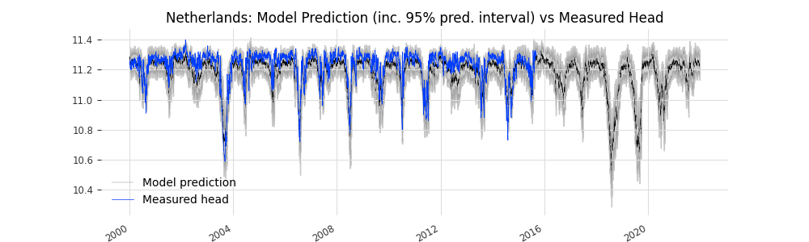
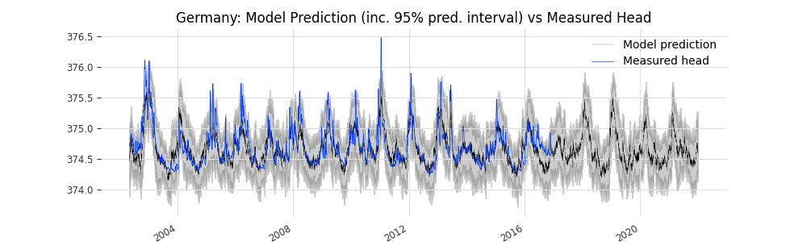
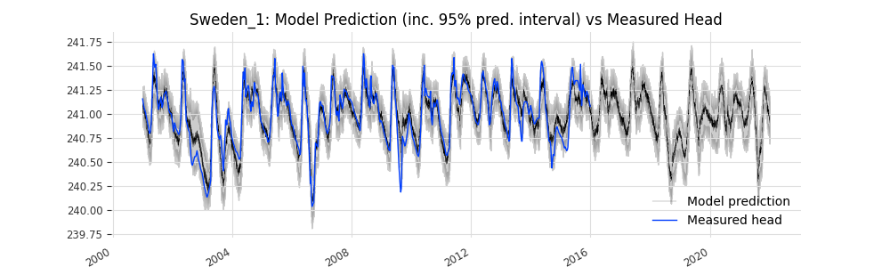
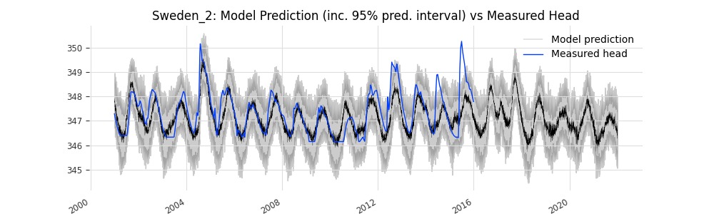

# Team LUHG

In this file the submission is described. 

## Author(s)

- Nikolas Benavides Höglund (Lund University, Department of Geology). Contact: nikolas (dot) hoglund (at) geol.lu.se

## Modeled locations

We modelled the following locations (check modelled locations):

- [x] Netherlands
- [x] Germany
- [x] Sweden 1
- [x] Sweden 2
- [x] USA

## Model description

We used the model N-HiTS as described in detail in [Challu et al., (2022)](https://arxiv.org/abs/2201.12886). N-HiTS is a deep-learning time-series forecasting model. The model is 
implemented in the [Darts](https://unit8co.github.io/darts/index.html) (Herzen et al., 2021) Python software package. Darts is a library developed for facilitating time-series forecasting, and relies on the machine-learning Python package PyTorch Lightning.

## Model workflow to reproduce

The model and prediction workflow was conducted using Python code in a single Jupyter Notebook (an interactive scripting/development environment). The data (as available to the participants) was split into 80/20 training / validation (calibration) segments. The complete workflow is described in detail using markdown, comments and code in the notebook `gwchallenge.ipynb`. The reader is referred to the notebook for further description of the workflow.

## Supplementary model data used

No supplementary model data was downloaded from outside sources. However, using the available input-data, a number of *feature engineered* datasets were constructed. The constructed datasets include the *cumulative sum of precipitation* over the last 15, 30 and 60 days respectively for all sites. For the ´USA´ site, an additional dataset containing *1-month change in river stage* was constructed.

## Estimation of effort

- Reading up on project description, exploring and visualizing input data ~ 2 hrs.
- Notebook / script development ~ 6 hrs.
- Darts "limitation" workaround ~ 2 hrs (described in the notebook).
- Evaluating different models (DeepTCN, Temporal Fusion Transformer) before deciding on N-HiTS ~ 4 hrs.
- Hyperparameter tuning ~ 4 hrs.
- Model training / calibration time (all sites) ~ 2 hrs
- Model prediction, visualization and export (all sites) ~ 1 hrs

AWS SageMaker Studio Lab was the environment used for model development and hydralic head prediction. Studio Lab currently runs on Intel(R) Xeon(R) Platinum 8259CL CPU @ 2.50GHz (of which 4 cores are allocated to the user), with 16GB ram and 15GB storage. No GPUs were used (free-GPU time is rarely available on Studio Lab).

## Additional information

As deep learning models are sensitive to randomized weights at the moment of instantiation, the exact results (although very similar) may not be reproducible by running the blocks of code in the notebook. Therefore, fitted model weights have been saved by the participant. Instantiating the models using the saved weights will enable exact reproducibility of the predicted hydraulic heads. Model weights are available upon request (the weights-files are likely too large to commit to the repo).

### Figures displaing measured head and predicted head

